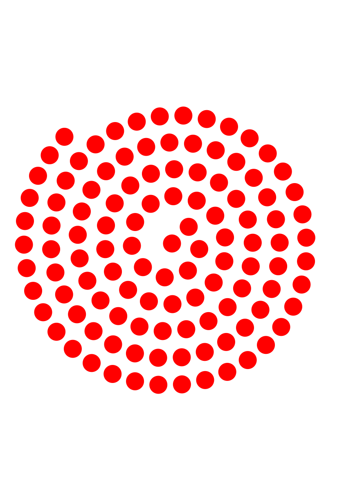

# Run Poster

After a hiatus of several years, I finally was able to attend classes again at our art school and started the course [graphic design and illustrations](https://www.heist-op-den-berg.be/grafisch-ontwerp-en-illustratie). One of the year-projects consisted in designing a poster depicting statistical information regarding a topic of our choice. I picked my Strava statistics ;-)

I could have chosen to do this manually, yet, I saw a great opportunity to combine it with some computer graphics and math to come up with a nice visualization of several of my statistics.

This repository and README are kind of a journal in my exploration over the course of this year, starting with downloading my stats from Strava, to setting up the canvas, choosing SVG as a format to exploring some uncharted math territory.

## Minimal Survival Commands

Want to run this yourself on your own Strava data? First [download your personal Strava data](https://support.strava.com/hc/en-us/articles/216918437-Exporting-your-Data-and-Bulk-Export) and unpack it in a checkout of this repository in a folder called `strava`. Next:

```console
% pip install requirements.txt
% python -m runposter strava/activities.csv > canvas.svg
```

This will produce a poster called `canvas.svg` based on this years activities.

## My Journal

### October 25: Spiraling Circles

In the end I want to print the poster on an A0 format, so I chose a canvas size of `width=841, height=1189` and started working on my first design, consisting of a circular representation of a run, arranging runs along an [Archimedean Spiral](https://en.wikipedia.org/wiki/Archimedean_spiral), using fixed distances between the consecutive circles.

Given an angle $\theta$ and a spiralling factor $a$, the cartesian positions are defined as:

$$
x = a \theta cos(\theta)
y = a \theta sin(\theta)
$$

Given a fixed in between distance $\Delta s$, we can compute the next $\theta$ using:

$$
\Delta \theta = \frac{\Delta s}{\sqrt{1+\theta^2}}
$$


