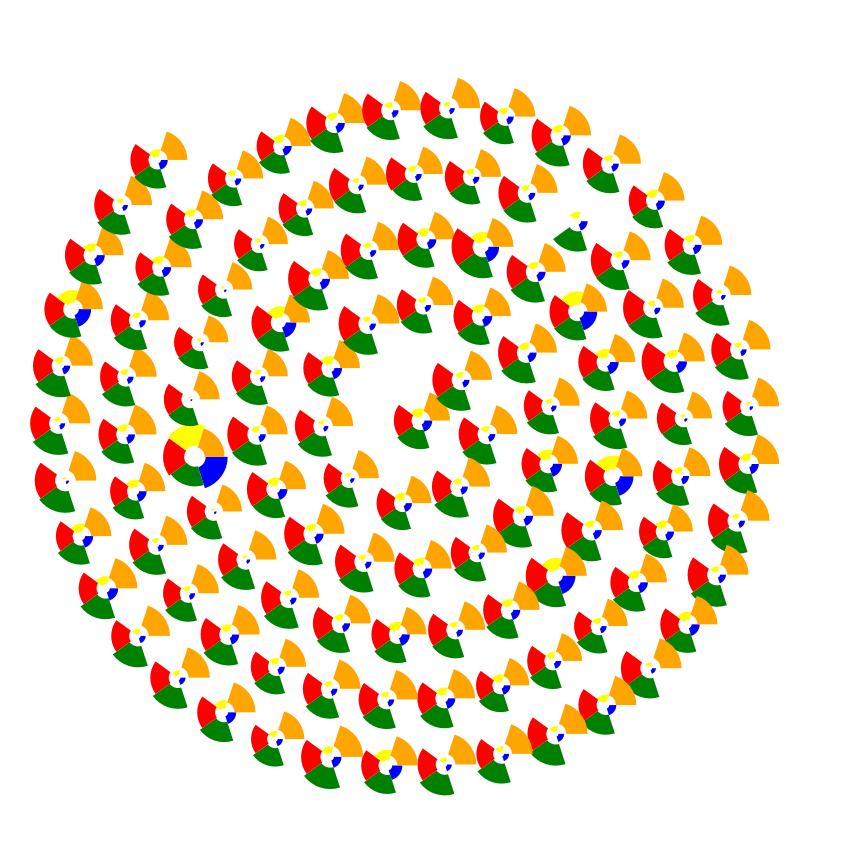
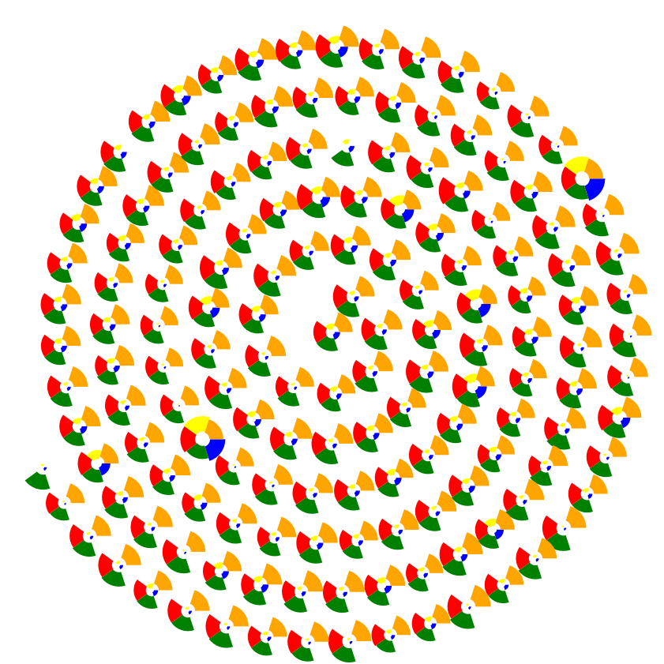
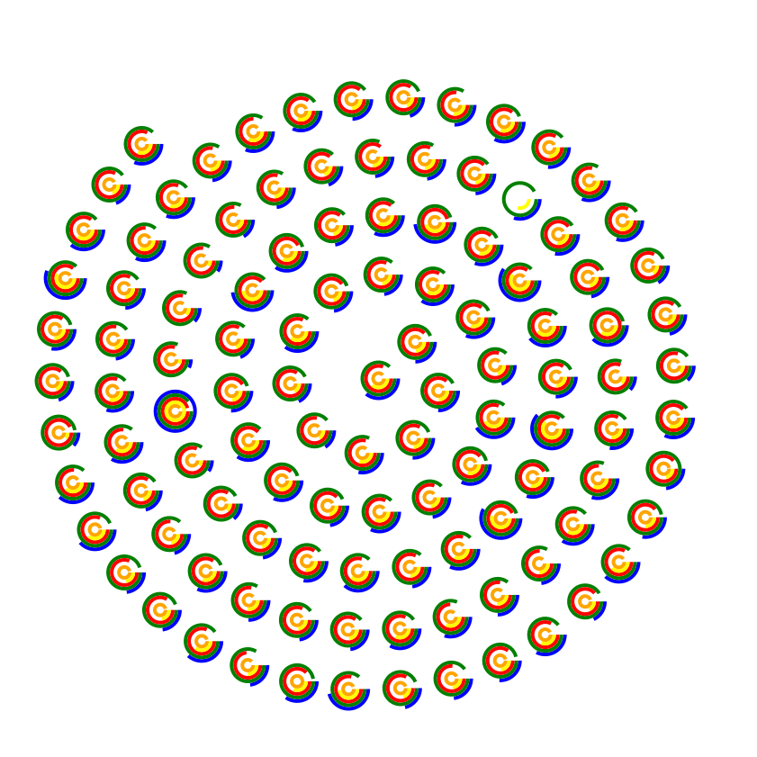
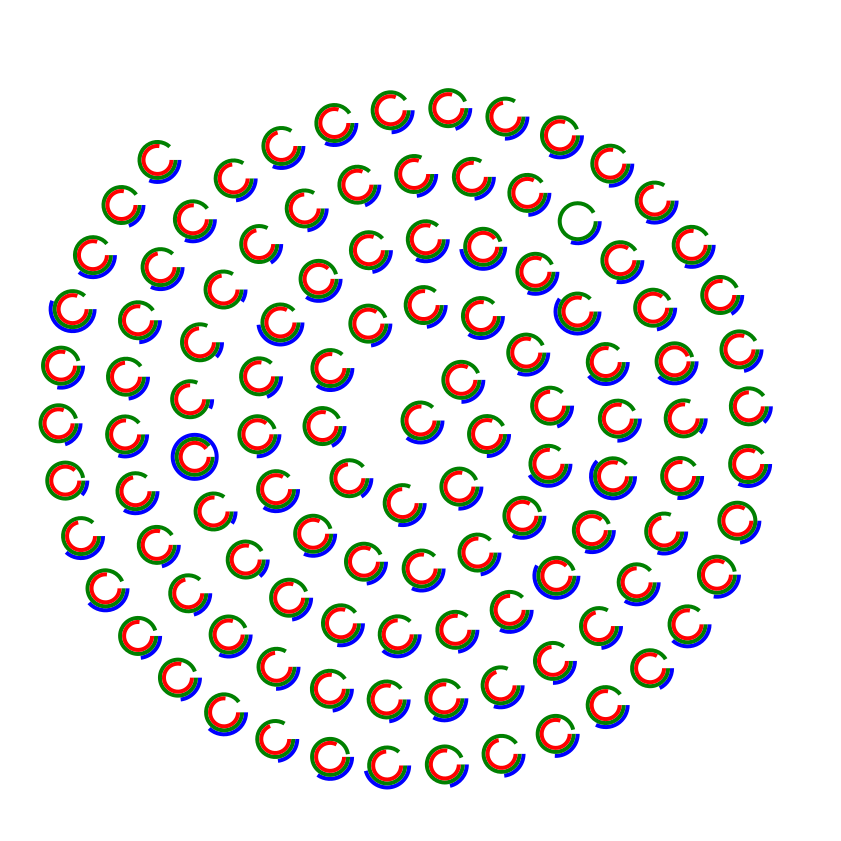
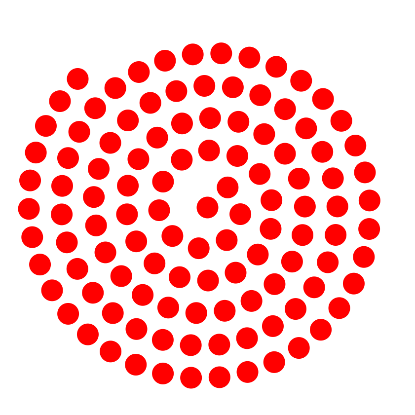

# Run Poster

After a long break of several years, I finally returned to our art school and enrolled in the course [graphic design and illustrations](https://www.heist-op-den-berg.be/grafisch-ontwerp-en-illustratie). One of the year-projects required me to design a poster that presented statistical information related to a topic of my choice. I decided to use my Strava statistics for this project.

While I could have manually created the poster, I saw an opportunity to integrate computer graphics and math to produce a visually appealing visualization of several of my statistics.

This repository and README document my journey throughout the year, beginning with downloading my statistics from Strava, setting up the canvas, and exploring uncharted mathematical concepts, using SVG as a format.

## Minimal Survival Commands

Want to run this yourself on your own Strava data? First [download your personal Strava data](https://support.strava.com/hc/en-us/articles/216918437-Exporting-your-Data-and-Bulk-Export) and unpack it in a checkout of this repository in a folder called `strava`. 

> I recently "finally" discovered `uv`, and you should too 😇

```console
% uv sync
% uv run python -m runposter render strava/activities.csv > canvas.svg
```

This will produce a poster called `canvas.svg` based on this years activities.

## My Journal

### May 11, 2026: Code Clean Up Before Finalizing

Time flies why you have a lot on your plate 🤷‍♂️ Apparently I was in the middle of a code clean up when I left this project hanging. Today no real progress, except for getting the code back up and running and introducing `uv` - my new Python toy 🤓

The remainder of the poster will be done in Illustrator.

### February 21, 2026: More Arcs

Played with segments today.



I also downloaded my entire Strave archive for 2025, which now also includes my Antwerp marathon.



### February 20, 2026: More Arcs

Added a few more statistics: `[ "moving time", "avg_cadence" ]`.



### February 16, 2026: Circles Consisting of Arcs

For every activity, I want to represent one of its recorded statistics as an arc, layering them on multiple adjacent distances, next to each other.

The first set of statistics I compiled was: `[ "distance", "avg_speed", "avg_heart_rate" ]`. The length of each arc represents a percentage with respect to the minimum and maximum values for that statistic.



💡 Can you find my first marathon, knowing that `distance` was blue?

### October 25, 2025: Spiraling Circles

In the end, I intend to print the poster on an A0 format. Therefore, I selected a canvas size of `width=841, height=1189` and started working on my initial design. This design features a circular representation of a run, with the runs arranged along an [Archimedean spiral](https://en.wikipedia.org/wiki/Archimedean_spiral). The design also implements fixed distances between the consecutive circles.

Given an angle $\theta$ and a spiralling factor $a$, the cartesian positions are defined as:

```math
x = a\ \theta\ cos(\theta)
```
```math
y = a\ \theta\ sin(\theta)
```

Credits to [Cye Waldman](https://math.stackexchange.com/users/424641/cye-waldman) for his answer on [Math StackExchange](https://math.stackexchange.com/a/2216736) that explains how, given a fixed in-between distance $\Delta s$, we can compute the next $\theta_{n} = \theta_{n-1} + \Delta \theta$ with

```math
\Delta \theta = \frac{\Delta s}{\sqrt{1+\theta_{n-1}^2}}
```


